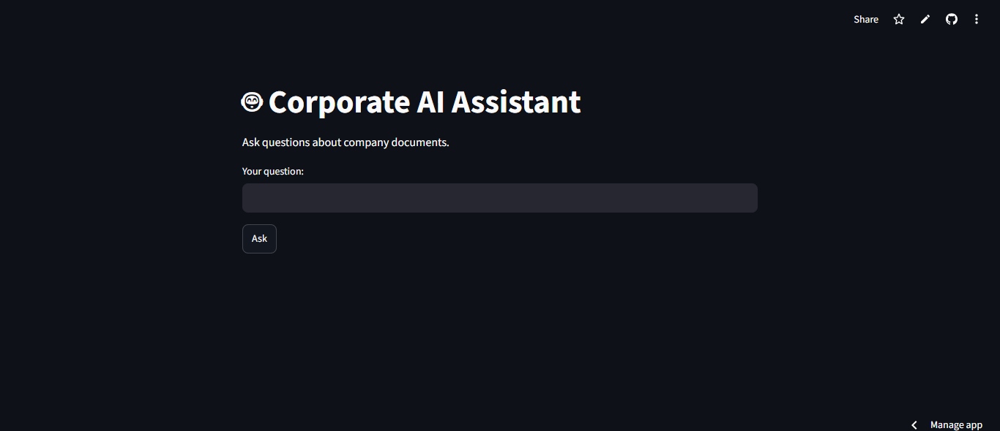

# 🤖 Corporate AI Assistant

An AI-powered corporate assistant built with **Python**, **LangChain**, **Ollama**, **FAISS**, and **Streamlit**. The assistant answers questions about company documents using Retrieval-Augmented Generation (RAG).

---

## 📌 Overview

Corporate AI Assistant allows employees to ask questions in natural language and receive answers based on internal company documents.

Instead of relying only on the language model, the application searches relevant company documents stored in a FAISS vector database before generating an answer.

This project demonstrates the implementation of a local RAG (Retrieval-Augmented Generation) application using open-source tools.

---

## ✨ Features

- 📄 Reads multiple document formats
  - PDF
  - DOCX
  - XLSX
  - CSV
  - HTML
  - Markdown
  - JSON
  - PPTX

- 🔍 Semantic search using FAISS

- 🧠 Local LLM powered by Ollama

- 💬 Streamlit web interface

- 🔒 Runs completely offline

- ⚡ Fast document retrieval

---

# 🏗 Project Architecture

```
User
   │
   ▼
Streamlit Interface
   │
   ▼
Assistant (LangChain)
   │
   ▼
Retriever (FAISS)
   │
   ▼
Relevant Documents
   │
   ▼
Ollama (Qwen 2.5)
   │
   ▼
Answer
```

---

# 📂 Project Structure

```
corporate-ai-agent/
│
├── chatbot/
│   ├── assistant.py
│   ├── retriever.py
│   └── __init__.py
│
├── documents/
│   ├── communication/
│   ├── finance/
│   ├── hr/
│   ├── legal/
│   ├── marketing/
│   ├── operations/
│   └── systems/
│
├── loaders/
│   └── load_documents.py
│
├── vectorstore/
│   ├── create_vector_db.py
│   └── faiss_index/
│
├── screenshots/
│
├── app.py
├── config.py
├── requirements.txt
├── test_assistant.py
├── test_retriever.py
├── README.md
└── LICENSE
```

---

# 🛠 Technologies

- Python 3.13
- LangChain
- Ollama
- Qwen2.5 1.5B
- Nomic Embed Text
- FAISS
- Streamlit
- PyPDF
- Docx2txt
- Pandas
- OpenPyXL

---

# 📦 Installation

Clone the repository

```bash
git clone https://github.com/RCarmelaVO/corporate-ai-agent.git
```

Go to the project

```bash
cd corporate-ai-agent
```

Create a virtual environment

```bash
python -m venv .venv
```

Activate it

### Windows

```bash
.venv\Scripts\activate
```

Install dependencies

```bash
pip install -r requirements.txt
```

---

# 🤖 Install Ollama

Download Ollama

https://ollama.com

Install the required models

```bash
ollama pull qwen2.5:1.5b
```

```bash
ollama pull nomic-embed-text
```

Verify installation

```bash
ollama list
```

---

# ▶ Create the Vector Database

```bash
python -m vectorstore.create_vector_db
```

---

# ✅ Test the Retriever

```bash
python test_retriever.py
```

Example output

```
Employee Handbook

Expense Policy

New Employee Onboarding
```

---

# ✅ Test the Assistant

```bash
python test_assistant.py
```

Example

```
Question:

How many vacation days do employees receive?

Answer:

Employees receive 30 calendar days of paid vacation every year after completing one year of service.
```

---

# 🚀 Run the Web App

```bash
streamlit run app.py
```

Then open

```
http://localhost:8501
```

---

# 📸 Screenshots

## Home Page



---

## Question Example


---

## Oracle Cloud Deployment


---

# 📚 Example Questions

- How many vacation days do employees receive?

- What are the working hours?

- Can employees work remotely?

- What expenses can be reimbursed?

- What happens during employee onboarding?

---

# 🔮 Future Improvements

- Conversation memory

- Chat history

- OCR support

- Multi-user authentication

- Voice input

- Oracle Cloud deployment

- Docker support

- API integration

---

# 📄 License

This project is licensed under the MIT License.

See the LICENSE file for more information.

---

# 👩‍💻 Author

**Raquel Carmela Villanueva Ospino**

GitHub:

https://github.com/RCarmelaVO
