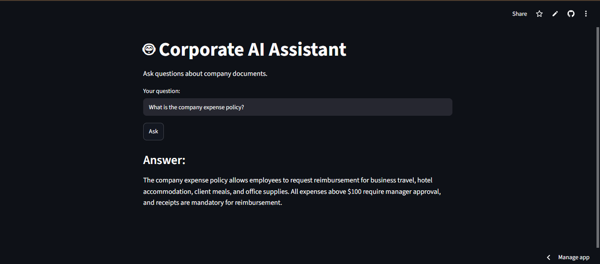
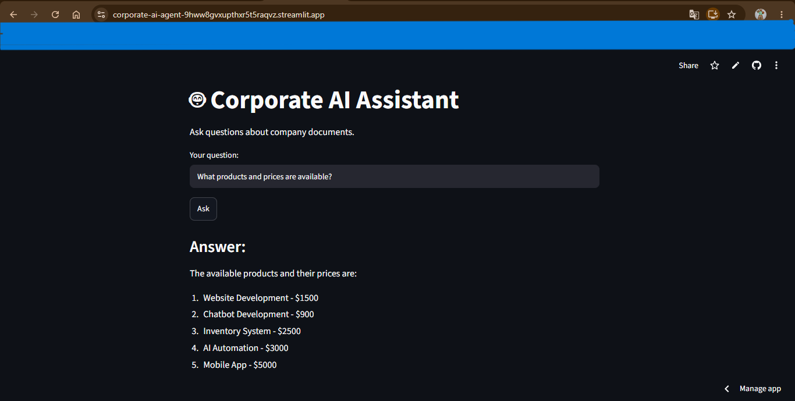

# 🤖 Corporate AI Assistant

An AI-powered corporate assistant designed to answer employee questions based on internal company documents using **Retrieval-Augmented Generation (RAG)**.

The assistant processes multiple document formats, creates a semantic knowledge base using vector embeddings, retrieves relevant information, and generates answers through a Large Language Model.

---

# 🌐 Live Demo

The application is deployed and available online:

https://corporate-ai-agent-9hww8gvxupthxr5t5raqvz.streamlit.app/

---

# 📌 Project Overview

Corporate AI Assistant is a conversational knowledge system created for a fictional company.

Employees can ask questions in natural language about internal documents related to:

- Human Resources
- Finance
- Operations
- Marketing
- Legal and Compliance
- Systems and APIs
- Company Information

The application uses a **Retrieval-Augmented Generation (RAG)** architecture, allowing the AI agent to search internal documents before generating responses.

---

# 🎯 Challenge Objective

This project was developed as part of the **Alura Agentes Challenge**.

The objective was to build an AI corporate agent capable of:

- Answering employee questions using company documents
- Processing multiple document formats
- Creating a centralized knowledge base
- Providing a conversational interface
- Being available through a public URL

---

# ✨ Features

## 📄 Document Processing

Supports:

- PDF
- DOCX
- XLSX
- CSV
- HTML
- Markdown
- JSON
- PPTX

## 🧠 AI Capabilities

- Semantic document search
- Retrieval-Augmented Generation (RAG)
- FAISS Vector Database
- Natural language question answering

## 💻 User Interface

- Streamlit Web Interface
- Public Cloud Deployment

---

# 🏗 System Architecture

```text
User
 │
 ▼
Streamlit Web Application
 │
 ▼
AI Assistant (LangChain)
 │
 ▼
Retriever
 │
 ▼
FAISS Vector Database
 │
 ▼
Relevant Company Documents
 │
 ▼
LLM (Groq - Llama 3.3 70B)
 │
 ▼
Generated Answer
```

---

# 📂 Project Structure

```text
corporate-ai-agent/
│
├── chatbot/
│   ├── assistant.py
│   ├── retriever.py
│   └── __init__.py
├── documents/
├── loaders/
├── vectorstore/
│   ├── create_vector_db.py
│   └── faiss_index/
├── screenshots/
├── app.py
├── config.py
├── requirements.txt
├── test_assistant.py
├── test_retriever.py
├── README.md
└── LICENSE
```

---

# 🛠 Technologies Used

- Python 3.13
- LangChain
- FAISS
- Streamlit
- Groq API
- Llama 3.3 70B
- HuggingFace Embeddings
- Sentence Transformers
- PyPDF
- Pandas
- OpenPyXL
- python-pptx
- docx2txt

---

# 📦 Installation

## Clone repository

```bash
git clone https://github.com/RCarmelaVO/corporate-ai-agent.git
```

## Access project

```bash
cd corporate-ai-agent
```

## Create virtual environment

```bash
python -m venv .venv
```

## Activate (Windows)

```bash
.venv\Scripts\activate
```

## Install dependencies

```bash
pip install -r requirements.txt
```

---

# 🧠 Creating the Vector Database

```bash
python -m vectorstore.create_vector_db
```

---

# ▶ Running Locally

```bash
streamlit run app.py
```

Open:

```text
http://localhost:8501
```

---

# 📸 Screenshots

## Home Page


## Question and Answer



## Public Deployment



---

# 💬 Example Question

**Question**

```text
What products and prices are available?
```

**Answer**

```text
Website Development - $1500
Chatbot Development - $900
Inventory System - $2500
AI Automation - $3000
Mobile App - $5000
```

---

# 🚀 Deployment

Deployed on Streamlit Cloud.

Public URL:

https://corporate-ai-agent-9hww8gvxupthxr5t5raqvz.streamlit.app/

---

# 🔮 Future Improvements

- Conversation memory
- User authentication
- Chat history
- OCR support
- Voice interaction
- Docker deployment
- API integration

---

# 📄 License

MIT License.

---

# 👩‍💻 Author

**Raquel Carmela Villanueva Ospino**

GitHub:

https://github.com/RCarmelaVO
